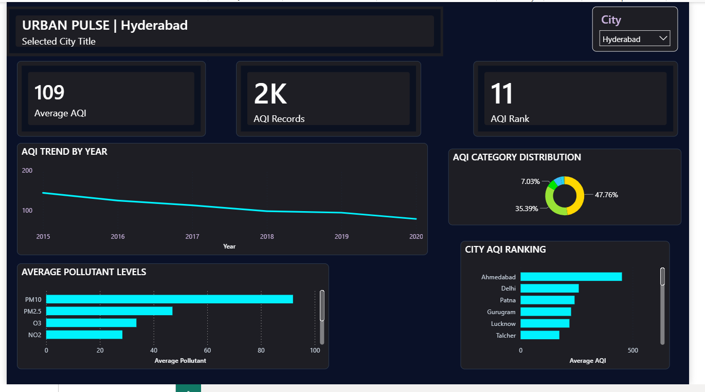
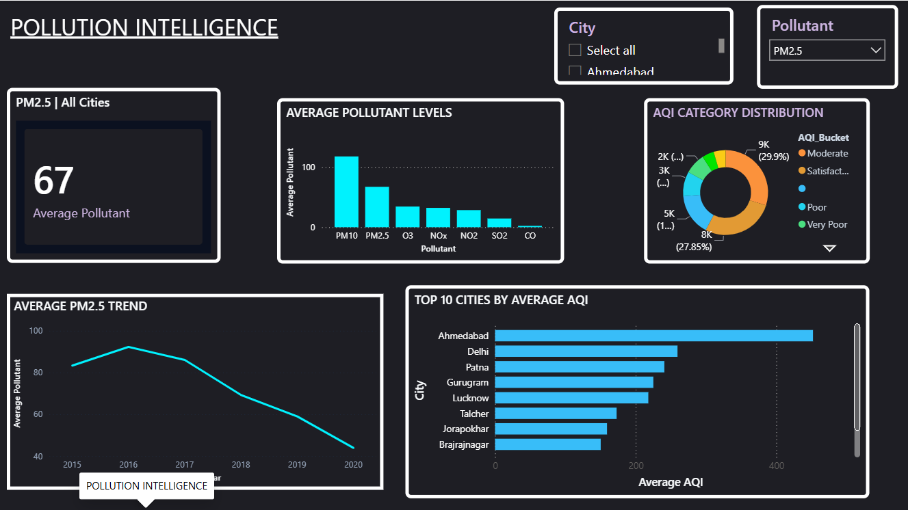

# 🌍 Urban Pulse — Air Quality Analysis

An interactive **Power BI dashboard** designed to analyze air quality across major Indian cities, identify pollution trends, compare pollutant levels, and provide city-level air quality insights.

The project transforms air-quality data into an interactive visual analytics experience using **Power BI, Power Query, DAX, and data visualization techniques**.

---

## 📊 Dashboard Overview

**Urban Pulse** contains two interactive dashboard pages:

### 1. Urban Pulse

Provides a high-level overview of air quality across cities.

**Key KPIs:**
- Average AQI
- Total AQI Records
- City AQI Rank

**Visualizations:**
- AQI Trend by Year
- AQI Category Distribution
- Average Pollutant Levels
- City AQI Ranking
- Interactive City Selection

### 2. Pollution Intelligence

Provides deeper analysis of individual pollutants and their relationship with air quality.

**Features:**
- Average Pollutant Level
- Pollutant Comparison
- AQI Category Distribution
- Pollutant Trend by Year
- Top 10 Cities by Average AQI
- Interactive City and Pollutant Selection

---

## 🎯 Project Objectives

The main objectives of this project are to:

- Analyze air quality patterns across Indian cities.
- Track AQI trends over time.
- Compare pollutant concentrations.
- Identify cities with higher average AQI levels.
- Understand the distribution of AQI categories.
- Enable interactive city-level and pollutant-level analysis.
- Present complex environmental data through an easy-to-understand dashboard.

---

## 🛠️ Tools & Technologies

| Tool | Purpose |
|---|---|
| **Power BI** | Dashboard development and data visualization |
| **Power Query** | Data cleaning and transformation |
| **DAX** | Measures, KPIs and analytical calculations |
| **Excel / CSV Dataset** | Source data |
| **GitHub** | Project documentation and portfolio |

---

## 📁 Dataset

The dataset contains air-quality measurements collected across multiple Indian cities and years.

### Key fields include:

- City
- Date
- PM2.5
- PM10
- NO
- NO2
- NOx
- NH3
- CO
- SO2
- O3
- Benzene
- Toluene
- Xylene
- AQI
- AQI Bucket

---

## 📈 Key Metrics

The dashboard includes analytical metrics such as:

- **Average AQI**
- **AQI Records**
- **AQI Rank**
- **Average Pollutant Levels**
- **AQI Category Distribution**
- **Year-over-Year AQI Trends**
- **City-level AQI Comparison**

---

## 🔎 Key Insights

Some of the insights explored through the dashboard include:

- AQI levels vary significantly across cities.
- AQI trends can be monitored across multiple years to identify changes in air quality.
- PM10 and PM2.5 are among the major pollutants analyzed in the dashboard.
- AQI category distribution helps identify the overall severity of air-quality conditions.
- City ranking enables quick identification of cities with relatively higher average AQI.
- Interactive filters allow users to explore individual cities and pollutants.

---

## 🎨 Dashboard Design

The dashboard was designed with a dark analytical theme and contrasting cyan/teal visual elements to improve readability and create a modern data-analytics look.

Interactive slicers allow users to dynamically explore:

- Cities
- Pollutants
- Time periods
- AQI categories

---

## 🖼️ Dashboard Preview

### Urban Pulse



### Pollution Intelligence



---

## 📂 Repository Contents

```text
Urban-Pulse-Air-Quality-Analysis/
│
├── Urban_Pulse_Air_Quality_Analysis.pbix
├── Page1_Urban_Pulse.png
├── Page2_Pollution_Intelligence.png
└── README.md
```

---

## 💡 Skills Demonstrated

This project demonstrates practical experience in:

- Data Cleaning
- Data Transformation
- Data Modeling
- DAX
- Power Query
- KPI Development
- Data Visualization
- Interactive Dashboard Design
- Trend Analysis
- Comparative Analysis
- Business Intelligence
- Data Storytelling

---

## 🚀 Project Outcome

The project demonstrates how raw environmental data can be transformed into an interactive **Business Intelligence dashboard** that enables users to explore air-quality trends, compare cities, analyze pollutants, and identify meaningful patterns.

---

## 👨‍💻 Author

**Vivek**

Aspiring Data Analyst | Power BI | SQL | Excel | Python

---

⭐ If you found this project useful, feel free to explore the repository and dashboard screenshots.
